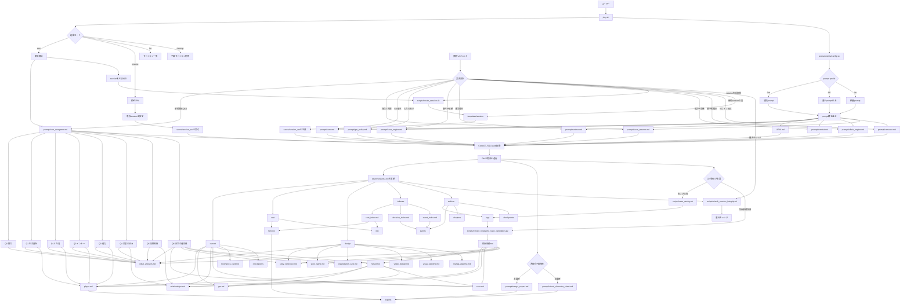
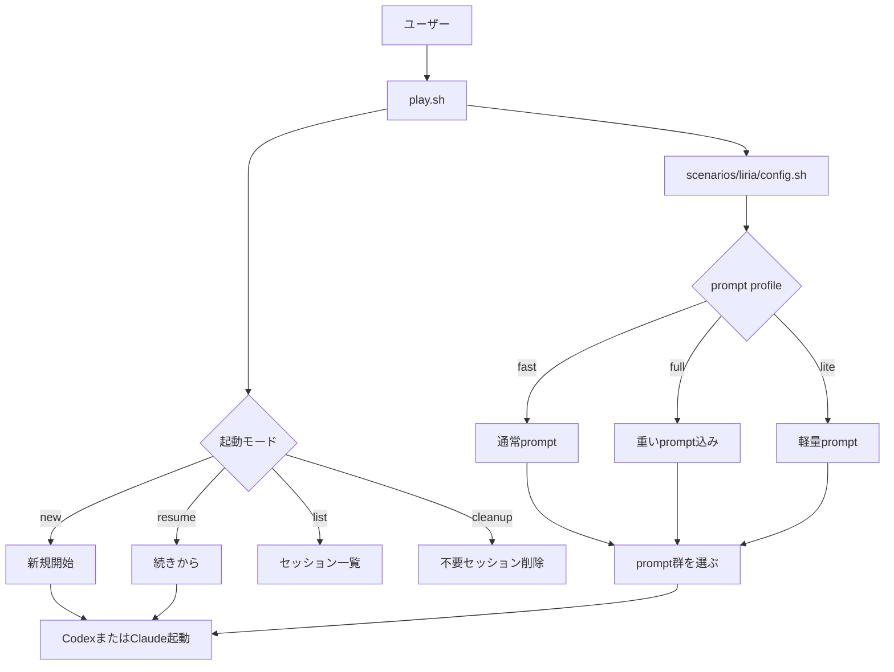
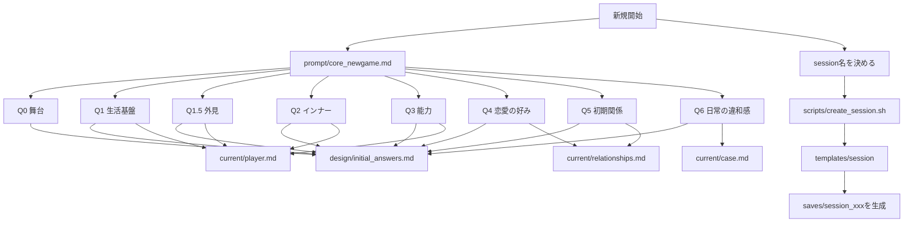
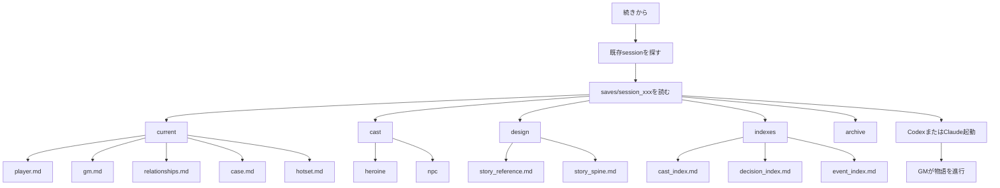
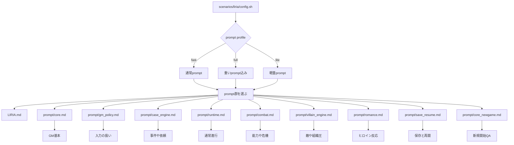
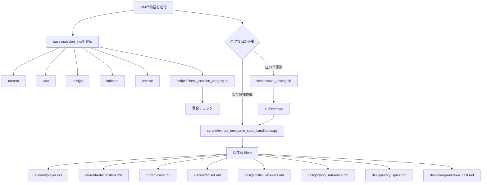
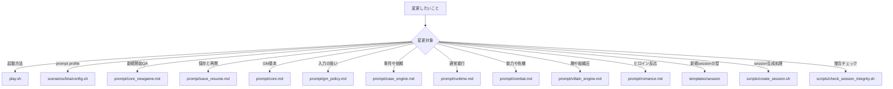

# LIRIA ファイル関係マップ

## このドキュメントの目的

このドキュメントは、LIRIA のフォルダ・ファイル関係を「どこが入口で、何を読み、何を生成し、どこを更新するか」という観点で見るための地図です。

プログラムの細かい実装ではなく、初めて触る人が次の流れを把握できることを目的にしています。

- `play.sh` から起動する
- `scenarios/liria/config.sh` と `prompt/` の内容を読んで GM を起動する
- `templates/session/` から `saves/session_xxx/` を生成する
- 進行中は `saves/session_xxx/current/` や関連フォルダを更新する
- 必要に応じてログ、復旧候補、漫画化・画像化用の出力を扱う

## Mermaid を見る方法

このファイルは Mermaid の `flowchart TD` を使っています。

- VS Code では Markdown Preview Mermaid Support などの Mermaid 対応拡張を入れて、Markdown プレビューを開いてください。
- Obsidian では Mermaid が有効な状態で、この Markdown を開いてください。
- 図が大きい場合は、プレビュー側でズームアウトするか、Obsidian の別ペイン表示で確認すると見やすくなります。

## LIRIA 全体のまとめ図

## 分割版

全体図が大きすぎる場合は、以下の分割図を用途別に見てください。各図は入口、生成、読み込み、保存、変更先を分けて確認できるようにしています。

### 1. 起動フロー

`play.sh` からどの起動モードに進み、どの設定を読んで GM 起動へ進むかを見る図です。

### 2. new時の生成フロー

新規開始時に Q&A を読み、session 名を決め、`templates/session/` から `saves/session_xxx/` を作る流れです。

### 3. resume時の読み込みフロー

既存 session を探し、保存済みの状態を読んで GM 起動へ渡す流れです。

### 4. session内部構造

`saves/session_xxx/` の中で、現在状態、人物、設計、索引、履歴がどこに分かれているかを見る図です。

```mermaid
flowchart TD
    I1[saves/session_xxx] --> I2[session.json]
    I1 --> I3[current]
    I1 --> I4[cast]
    I1 --> I5[design]
    I1 --> I6[indexes]
    I1 --> I7[archive]
    I3 --> I8[player.md]
    I3 --> I9[gm.md]
    I3 --> I10[relationships.md]
    I3 --> I11[case.md]
    I3 --> I12[hotset.md]
    I3 --> I13[mechanics_card.md]
    I3 --> I14[checkpoints]
    I4 --> I15[heroine]
    I4 --> I16[npc]
    I5 --> I17[initial_answers.md]
    I5 --> I18[story_reference.md]
    I5 --> I19[story_spine.md]
    I5 --> I20[organization_cast.md]
    I5 --> I21[villain_design.md]
    I5 --> I22[visual_pipeline.md]
    I5 --> I23[manga_pipeline.md]
    I6 --> I24[cast_index.md]
    I6 --> I25[decision_index.md]
    I6 --> I26[event_index.md]
    I7 --> I27[logs]
    I7 --> I28[events]
    I7 --> I29[chapters]
    I7 --> I30[checkpoints]
```

### 5. promptレイヤ関係

起動設定が prompt 群を選び、各 prompt が GM の振る舞いを担当する関係を見る図です。

### 6. 保存・ログ復旧フロー

GM 進行後に session が更新される流れと、生ログから復旧候補を作る流れを見る図です。

### 7. 変更したい時にどこを触るか

目的別に、最初に確認するファイルやフォルダを探すための図です。

## 図の補足説明

図は大きく 5 つの流れに分かれています。

1. 起動入口は `play.sh` です。ユーザーは `new`、`resume`、`list`、`cleanup` のような起動モードを選びます。
2. 起動時に `scenarios/liria/config.sh` が読まれ、`fast`、`full`、`lite` のような prompt profile に応じて読む prompt 群が決まります。
3. 新規開始では `prompt/core_newgame.md` の Q&A を使い、`scripts/create_session.sh` が `templates/session/` を元に `saves/session_xxx/` を作ります。
4. 再開では既存の `saves/session_xxx/` を読み、保存済みの状態から GM を起動します。
5. GM 進行中は `saves/session_xxx/current/`、`cast/`、`design/`、`indexes/`、`archive/` が更新されます。

`current/` は現在のプレイ状態、`cast/` は登場人物、`design/` は設計情報、`indexes/` は参照用の索引、`archive/` は履歴やログを置く場所です。

漫画化や画像化は通常進行とは別の必要時ルートです。`prompt/manga_export.md` や `prompt/visual_character_sheet.md` を使い、`exports/` に出力する流れとして読んでください。

ログ復旧も必要時ルートです。`scripts/save_rawlog.sh` で生ログを残し、復旧候補を作って `current/` や `design/` に反映する流れです。

## 正本・キャッシュ・ログの違い

| 種類 | 主な場所 | 役割 | 変更時の考え方 |
|---|---|---|---|
| 正本 | `prompt/`、`scenarios/liria/config.sh`、`templates/session/` | 起動時に読むルールや、新規 session の雛形 | 仕様を変えたい時に編集する |
| session 正本 | `saves/session_xxx/current/`、`cast/`、`design/` | 現在のプレイ状態、人物、設計情報 | 進行結果として更新される |
| キャッシュ | `current/hotset.md`、`indexes/` | 再開や参照を速くするための要約・索引 | 元の状態やログから再生成できる前提で扱う |
| ログ | `archive/logs/`、`archive/events/`、`archive/chapters/` | 過去の会話、イベント、章の履歴 | 後から復旧・確認するために残す |
| 出力 | `exports/` | 漫画化や画像化など、外部利用向けの成果物 | 本体状態とは分けて扱う |

正本を編集すると、以後の起動や新規 session に影響します。キャッシュや索引は便利な参照用ですが、正本そのものではありません。ログは過去の証跡なので、削除すると復旧や検証が難しくなります。

## 変更したい時にどこを触るか

| 変更したいこと | 主に見る場所 |
|---|---|
| 起動方法やモード分岐を変えたい | `play.sh` |
| LIRIA シナリオの prompt profile を変えたい | `scenarios/liria/config.sh` |
| 新規開始の Q&A を変えたい | `prompt/core_newgame.md` |
| 保存と再開の考え方を変えたい | `prompt/save_resume.md` |
| GM の基本方針を変えたい | `prompt/core.md` |
| 入力の扱いを変えたい | `prompt/gm_policy.md` |
| 事件や依頼の進め方を変えたい | `prompt/case_engine.md` |
| 通常進行のルールを変えたい | `prompt/runtime.md` |
| 能力や危機の扱いを変えたい | `prompt/combat.md` |
| 敵や組織圧を変えたい | `prompt/villain_engine.md` |
| ヒロイン反応を変えたい | `prompt/romance.md` |
| 新規 session の初期ファイル構成を変えたい | `templates/session/` |
| session 生成処理を変えたい | `scripts/create_session.sh` |
| session の整合チェックを変えたい | `scripts/check_session_integrity.sh` |

まず `play.sh` から入口を確認し、次に `scenarios/liria/config.sh` で読む prompt 群を確認すると、どのファイルがどのタイミングで使われるか追いやすくなります。
